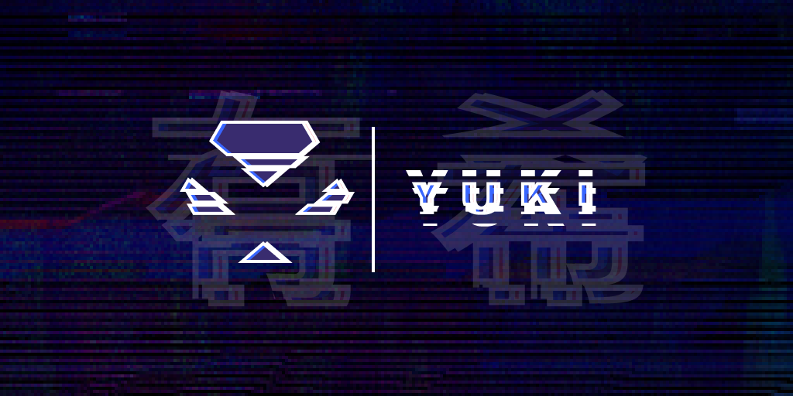

<p align="center">
	
</p>

<p align="center">
	
</p>

<p align="center">
	<h1>Portfolio</h1>
	<p>Personal website with the pourpose of sharing my work to the world.</p>
</p>

---

<p align="center">
 <a href="#technology">Technology</a> •
 <a href="#installation">Installation</a> •
	<a href="https://portfolio-yuki2dev.vercel.app/">Visit the website</a>
</p>

## Technology

<p align="left">
  
  
  
  
</p>

## Installation

1. First, clone this repository

```bash
git clone https://github.com/KeysHD/portfolio.git
```

2. Install all the dependencies

```bash
yarn install
```

3. Run the project

```bash
yarn dev
```

4. Navigate to `https://localhost:3000`
